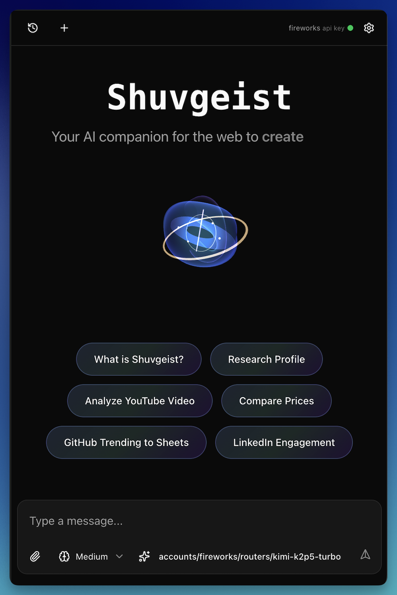
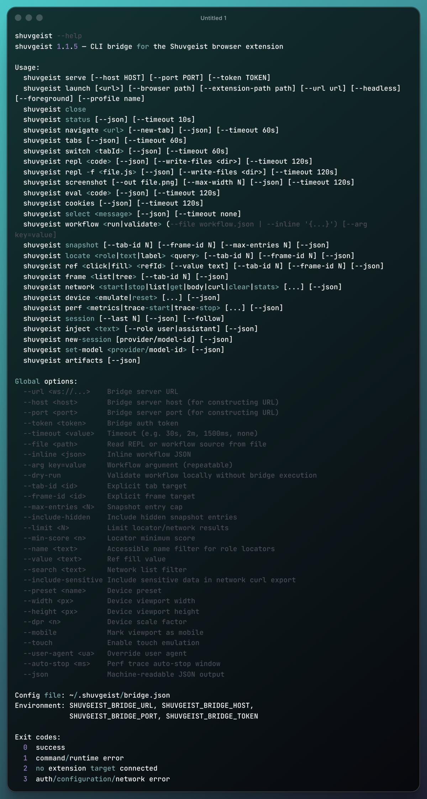

# Shuvgeist

Shuvgeist is a Chrome/Edge sidepanel extension for browser-native AI assistance and browser automation. It gives an LLM a controlled toolset for navigating pages, running page-context JavaScript, extracting structured data, working with attachments and artifacts, and reusing domain-specific skills you teach it over time.

This repo also ships:

- the `shuvgeist` CLI bridge for terminal-driven browser control
- a self-hostable CORS proxy for browser-restricted provider flows
- the static marketing/install site at `site/`

Works on Chrome 141+ and equivalent Edge builds.

## Screenshots

### Extension sidebar



### CLI bridge



## What ships today

### Extension

The extension lives in the browser sidepanel and persists its data locally in IndexedDB. Current user-facing capabilities include:

- chat sessions with resumable history and renameable titles
- file attachments and artifact generation
- page navigation and tab management
- REPL execution in an extension sandbox with page-context `browserjs()` access
- domain skills that inject reusable site-specific helpers into page scripts
- interactive element disambiguation when DOM targeting is unclear
- image extraction and document extraction tools
- Kokoro-first text-to-speech with page-bound read-along highlighting and audio-only cloud fallback paths
- optional debugger-backed tooling for stubborn sites that reject synthetic DOM events
- daily cost tracking with provider/model breakdowns
- settings tabs for subscriptions, providers/models, skills, bridge state, costs, and about/theme

### Provider and model support

Shuvgeist supports two main auth/config paths:

- Subscription login inside the extension:
  - Anthropic (Claude Pro/Max)
  - ChatGPT Plus/Pro via OpenAI Codex OAuth
  - GitHub Copilot
  - Google Gemini
- API key and custom-provider setup through the Providers & Models UI

The repo also includes:

- built-in MiniMax extension model registrations
- custom provider import/export
- `provider-presets/proxx.json` for the local `proxx` gateway workflow

### Skills

Skills are stored locally and matched by domain glob. The extension ships with a default skill library and a full skill manager UI:

- search/filter skills
- edit descriptions, examples, and injected library code
- import/export skill packs
- auto-inject matching skill libraries into `browserjs()` execution

An external coding-agent skill for driving the CLI bridge is included at `skills/shuvgeist/`.

### CLI bridge

The CLI bridge exposes the browser to terminal tools, scripts, and coding agents. The bridge server is a WebSocket relay between the CLI and the extension background worker.

Current CLI surface:

- browser lifecycle: `launch`, `close`, `status`
- navigation: `navigate`, `tabs`, `tabs close`, `switch`, `windows`
- page execution: `repl`, `eval`, `screenshot`, `cookies`, `select`
- page assertions: `assert expr`, `assert text`, `assert selector`, `assert role`, `assert label`, `assert url`
- deterministic workflows: `workflow run`, `workflow validate`
- semantic page inspection: `snapshot`, `locate`, `ref`, `frame`
- debugger-backed diagnostics: `network`, `device`, `perf`
- video repro capture: `record start`, `record stop`, `record status` using CDP screencast plus CLI-side ffmpeg encoding
- Electron desktop targets: `electron list`, `electron allow`, `electron attach`, `electron launch`, `electron windows`, and `--target electron:...`
- session control: `session`, `inject`, `new-session`, `set-model`, `artifacts`

Run `shuvgeist --help` for the full command reference.

### Supporting subprojects

- `proxy/`: minimal self-hosted CORS proxy with host allowlisting and filtered headers
- `site/`: static landing page and install guide

## Architecture

High-level flow:

`Chrome/Edge sidepanel UI -> Background coordinator -> Offscreen agent/tool runtime -> Background-authorized active tab(s)`

CLI flow:

`shuvgeist CLI -> Bridge server -> Extension background worker -> tab/session tools`

Electron CLI flow:

`shuvgeist CLI -> Bridge server -> Electron CDP endpoint`

Electron requests are handled bridge-local and do not require a connected Chrome/Edge extension target. Chrome remains the default target when `--target` is omitted.

Important package boundaries:

- `packages/protocol/`: schema-first commands, wire contracts, targets, and shared protocol metadata
- `packages/driver/`: target-neutral PageDriver, semantic refs, capture engines, and injected driver artifacts
- `packages/extension/`: sidepanel, offscreen agent runtime, background coordinator, settings UI, and Chrome adapters
- `packages/server/`: bridge server, Electron sessions, MCP, Node configuration, and local target execution
- `packages/cli/`: public `shuvgeist` CLI, discovery, launch/autostart, and direct-CDP runtime

See [ARCHITECTURE.md](ARCHITECTURE.md) for a deeper code-oriented walkthrough. For the local-first TTS overlay and Kokoro read-along flow, see [docs/tts.md](docs/tts.md).

## Install

### Install from a release

1. Download the latest release from [GitHub Releases](https://github.com/shuv1337/shuvgeist/releases/latest).
2. Unzip it somewhere stable.
3. Open `chrome://extensions/` or `edge://extensions/`.
4. Enable Developer mode.
5. Click `Load unpacked` and select the extension directory.
6. In the extension details, enable:
   - `Allow user scripts`
   - `Allow access to file URLs`
7. Set site access to `On all sites`.

Open the sidepanel with:

- macOS: `Command+Shift+S`
- Windows/Linux: `Ctrl+Shift+S`

On first launch, connect at least one provider.

### Build from source

This repo expects sibling checkouts for linked packages:

```text
parent/
  mini-lit/
  pi-mono/
  shuvgeist/
```

Install and build dependencies first:

```bash
cd ../mini-lit && npm install && npm run build
cd ../pi-mono && npm install && npm run build
cd /path/to/shuvgeist && npm install
```

Build outputs:

```bash
npm run build       # extension -> dist-chrome/
npm run build:cli   # CLI -> dist-cli/shuvgeist.mjs
```

Recording from the CLI requires `ffmpeg` on PATH. The current recorder is video-only (no audio) and keeps the existing sensitive-browser-access gate.

Load `dist-chrome/` as an unpacked extension.

## Quick start

### Sidepanel

1. Open the sidepanel.
2. Connect a subscription or add an API key/custom provider.
3. Pick a model.
4. Start with a task that needs a real browser, for example:
   - "Open the current site and summarize this page."
   - "Extract the visible products into a CSV artifact."
   - "Teach yourself this site and save it as a skill."

### CLI bridge

Build and stage the installable CLI package:

```bash
npm run package:cli
package_version="$(node -p 'require("./static/manifest.chrome.json").version')"
npm install -g "./shuvgeist-${package_version}.tgz"
```

The source workspace is intentionally not directly packable: `npm pack --workspace shuvgeist` fails closed because its development manifest contains private workspace dependencies. Always use `npm run package:cli`, which emits the dependency-free six-file public package.

Basic examples:

```bash
shuvgeist status
shuvgeist navigate "https://example.com"
shuvgeist tabs --json
shuvgeist tabs close 123 --json
shuvgeist tabs close --title-match shuvplan --dry-run --json
shuvgeist tabs close --title-match shuvplan --yes --json
shuvgeist windows --json
shuvgeist screenshot --out page.png
shuvgeist record start --out /tmp/example.webm --max-duration 5s
shuvgeist repl 'return await browserjs(() => document.title)'
shuvgeist assert text "Example Domain" --timeout 10s
shuvgeist snapshot --json
shuvgeist locate text "Sign in" --json
```

### Deterministic e2e smoke

Use `assert` for CI-style page checks instead of embedding assertions in REPL snippets. Assertions run against the page context by default and return structured results in `--json` mode.

```bash
shuvgeist launch --url http://127.0.0.1:3000 --headless --user-data-dir "${RUNNER_TEMP:-/tmp}/shuvgeist-profile" --json
shuvgeist status --json
shuvgeist assert text "Welcome" --timeout 10s --json
shuvgeist assert role button --name "Continue" --visible --json
shuvgeist assert selector "form [type=submit]" --enabled --json
```

Use workflow target pinning for multi-step tests so focus changes do not move the target tab:

```json
{
  "target": { "mode": "new-tab" },
  "steps": [
    { "method": "navigate", "params": { "url": "http://127.0.0.1:3000" } },
    { "assert": { "kind": "text", "text": "Welcome" }, "as": "welcome" }
  ]
}
```

Semantic refs use DOM actions by default. Chrome keeps the legacy `--native` mode; use `--trusted` (alias `--cdp-input`) for renderer-scoped CDP input on either supported target:

```bash
shuvgeist locate label "Email" --json
shuvgeist ref fill <refId> --value "user@example.com" --native
shuvgeist ref fill <refId> --value "user@example.com" --trusted
```

`--native` and `--trusted` are mutually exclusive. Trusted ref actions never fall back to DOM events. `ref fill` handles text inputs, textareas, selects, and editable elements including empty and `plaintext-only` `contenteditable` values. It preserves explicit ARIA role precedence and dispatches cancelable `beforeinput` followed by `input`; a canceled `beforeinput` is reported as a failed action. For clicks that trigger async same-tab navigation, pass a bounded wait:

```bash
shuvgeist ref fill <selectRefId> --value "Low to High" --json
shuvgeist ref click <buttonRefId> --timeout 5s --json
```

Before treating a machine as CI-ready, verify that `shuvgeist launch --headless --json` produces a connected extension target, `status --json` advertises the `page_assert` capability, and the local fixture assertions pass. See [docs/e2e-ci.md](docs/e2e-ci.md) for the full checklist, assertion flags, workflow target modes, native ref caveats, and exit-code contract.

### Electron targets

Electron support is explicit because it attaches to a local app's Chrome DevTools Protocol endpoint. Allow an app before launching or attaching:

```bash
shuvgeist electron list --json
shuvgeist electron allow vscode
```

Known app references include `vscode`, `shuvscode`, `codex`, `codex-desktop`, `slack`, `legcord`, `signal`, `signal-desktop`, and `obsidian`.

For Codex Desktop on Linux, the registry recognizes the packaged launcher at `/usr/bin/codex-desktop` and the Electron runtime at `/opt/codex-desktop/codex-desktop-electron`. Allow, diagnose, and attach by alias:

```bash
shuvgeist electron allow codex
shuvgeist electron doctor codex --json
shuvgeist electron attach codex --json
```

The targeted doctor requires an exact Codex Desktop executable match and confirms that process owns its listening `--remote-debugging-port` before probing the loopback endpoint, even when it is outside the configured Shuvgeist launch range.

Use `launch` when Shuvgeist should start a known Electron app with a remote debugging port:

```bash
shuvgeist electron launch vscode --json
```

Use `attach` when the app is already running with `--remote-debugging-port=<port>` or when Shuvgeist can discover that port from the app or process:

```bash
shuvgeist electron attach vscode --json
shuvgeist electron attach --pid 12345 --json
shuvgeist electron attach --port 9229 --json
```

List windows and assign labels when multiple renderers are present:

```bash
shuvgeist electron windows --json
shuvgeist electron label e1 w1 main
```

Target Electron windows with `--target`. Supported forms include `electron:e1:w1`, `electron:e1:main`, `electron:vscode:w1`, and `electron:e1/w1`.

```bash
shuvgeist screenshot --target electron:e1:w1 --out /tmp/electron.png
shuvgeist eval "document.title" --target electron:e1:main --json
shuvgeist snapshot --target electron:e1:w1 --json
shuvgeist locate role button --name "Run" --target electron:e1:w1 --json
shuvgeist ref click <refId> --trusted --target electron:e1:w1 --json
shuvgeist record start --target electron:e1:w1 --out /tmp/electron.webm --max-duration 5s
```

Electron trusted input is renderer-scoped CDP synthesis, not operating-system input. It is fail-closed and must be enabled for the exact app in `~/.shuvgeist/bridge.json`:

```json
{
  "electron": {
    "capabilities": {
      "com.microsoft.VSCode": { "cdp_input": true }
    }
  }
}
```

`--cdp-input` is an alias for `--trusted`. Electron `--native` is intentionally unsupported because Shuvgeist does not synthesize OS-level mouse or keyboard input.

Target-scoped JSON results identify the resolved page as either a Chrome tab or an Electron session/window/target and include its `navigationGeneration`. Top-level `tabId` and `frameId` remain optional Chrome compatibility fields; Electron results never use negative tab sentinels.

Security notes:

- Only allow apps you intend to inspect. The allowlist is stored in `~/.shuvgeist/bridge.json`.
- Electron commands operate over local CDP and can read renderer DOM, screenshots, page state, and recording frames.
- `shuvgeist cookies` remains a Chrome/Edge extension command and is not routed to Electron targets. The parsed Electron `cookies` capability key is retained for configuration compatibility but does not enable Electron cookie access.
- Renderer input requires the separate per-app `cdp_input` capability and is re-authorized against the live session/window before dispatch.
- `record start` still requires `ffmpeg` on PATH because the CLI encodes received CDP frames into WebM.
- Recording JSON distinguishes raw captured-frame bytes (`sourceBytes`) from the final WebM file size (`encodedSizeBytes`); deprecated `sizeBytes`, when present, is the encoded size.

Troubleshooting:

- Unknown app: run `shuvgeist electron list --json` and use one of the listed IDs or aliases.
- App is not allowlisted: run `shuvgeist electron allow <app-id-or-alias>`.
- No CDP port found: restart the app with `--remote-debugging-port=<port>` and pass `--port <port>`.
- Wrong window: run `shuvgeist electron windows --json`, label the intended window, then target the label.
- Extension disconnected errors on Electron commands usually mean the command was not given an Electron `--target`; Chrome is the default target.

`shuvgeist status` reports browser-extension connectivity and server-verified Electron liveness separately. Cached sessions whose CDP endpoint or renderer page has disappeared are reported as stale; a disconnected extension does not block a live Electron session.

The CLI auto-starts the local bridge when needed. Bridge config is resolved from:

1. command-line flags
2. environment variables
3. `~/.shuvgeist/bridge.json`
4. built-in defaults

Supported env vars:

- `SHUVGEIST_BRIDGE_URL`
- `SHUVGEIST_BRIDGE_HOST`
- `SHUVGEIST_BRIDGE_PORT`
- `SHUVGEIST_BRIDGE_TOKEN`
- `SHUVGEIST_BRIDGE_CONFIG` (override the bridge config path)
- `SHUVGEIST_OTEL_ENABLED`
- `SHUVGEIST_OTEL_INGEST_URL`
- `SHUVGEIST_OTEL_PRIVATE_INGEST_KEY`

Automatic startup is deliberately narrower than connection support. It requires the exact `/ws` path with no query or fragment, plain `ws://` transport, and exactly `localhost`, `127.0.0.1`, or `::1`; it binds that approved loopback host and port and runs `<repo>/node_modules/.bin/tsx <repo>/packages/cli/src/cli.ts serve`. Every other endpoint—including TLS, remote, wildcard, alternate loopback, and custom-path URLs—must be started explicitly. A manual `shuvgeist serve` resolves its bind host and port independently from the client `url`, so a persisted remote connection URL is never reused as a local listener.

When a flag or environment variable temporarily selects a different local endpoint, provide `--token` or `SHUVGEIST_BRIDGE_TOKEN` for reusable or concurrent access. An automatically generated token is returned only to the process that started that transient endpoint and is never written over credentials for an unrelated persisted URL.

Browser and extension discovery uses `~/.shuvgeist/config.json` (override with `SHUVGEIST_CONFIG`; `SHUVGEIST_DISCOVERY_CONFIG` is retained as an alias). Missing flag, environment, or file candidates fall through in order; malformed configuration stops discovery with the exact failing path.

Exit codes:

- `0`: success
- `1`: assertion failure or command/runtime error
- `2`: no extension target connected
- `3`: auth/configuration/network error

## Bridge details

The extension stores bridge settings in browser storage and exposes them in `Settings -> Bridge`.

Current bridge behavior:

- same-host loopback is the default
- the background worker owns the bridge connection
- the Bridge tab can block bridge access entirely
- sensitive browser data access is separately gated
- remote/LAN bridge URL and token overrides are supported

Sensitive bridge access enables commands such as:

- `shuvgeist eval`
- `shuvgeist assert expr --world main`
- `shuvgeist cookies`
- `shuvgeist network get`
- `shuvgeist network body`
- `shuvgeist network curl`

### Bridge management

The bridge is managed automatically by the extension and CLI. You do not need to install or run a separate systemd unit.

## Proxy

Shuvgeist includes a self-hostable proxy in `proxy/` for provider flows that still need CORS help from a browser context.

Why it exists:

- some provider auth/token flows cannot be called directly from the extension
- some API integrations are intentionally proxied
- document extraction can also use the proxy

Run it locally:

```bash
cd proxy
npm install
npm run dev
```

See [proxy/README.md](proxy/README.md) for deployment, allowlist, and security details.

## Development

### Watch mode

Start the extension, linked-package watchers, and site dev server:

```bash
./dev.sh
```

Extension-only watcher:

```bash
npm run dev
```

### Checks and tests

Primary repo check:

```bash
./check.sh
```

That runs formatting, typechecking, unit tests, integration tests, and the site checks.

Additional test entry points:

```bash
npm run test
npm run test:unit
npm run test:integration
npm run test:component
npm run test:e2e
npm run test:e2e:extension
npm run test:e2e:site
npm run test:coverage
```

### Development rules that matter in practice

- after extension UI/runtime changes, rebuild with `npm run build` so `dist-chrome/` is current
- after CLI bridge changes, rebuild with `npm run build:cli`
- linked `../mini-lit` or `../pi-mono` changes must be rebuilt in those repos before rebuilding Shuvgeist
- preserve the repository's intentional dependency forms and lockstep pins described in [docs/dependencies.md](docs/dependencies.md)
- the bridge is managed automatically; do not run it as a separate ad-hoc shell process

## Project layout

```text
packages/
  protocol/                  shared wire schemas, commands, targets, and version contract
  driver/                    target-neutral PageDriver and injected driver artifacts
  extension/                 Chrome extension UI, background, offscreen runtime, and adapters
  server/                    local bridge server, Electron, MCP, and Node configuration
  cli/                       public CLI, discovery, autostart, and direct-CDP runtime
scripts/                     root boundary checks and cross-package artifact generation
static/
  manifest.chrome.json       extension manifest and version source
site/
  src/frontend/              marketing site and install page
proxy/
  src/                       self-hosted CORS proxy
provider-presets/
  proxx.json                 importable custom provider preset
skills/
  shuvgeist/                 coding-agent skill for the CLI bridge
tests/
  unit/ integration/ component/ e2e/
```

## Website

The static site lives in `site/`.

Local dev:

```bash
cd site
./run.sh dev
```

Build:

```bash
cd site
./run.sh build
```

Deploy:

```bash
cd site
SERVER_DIR=/path/on/server ./run.sh deploy
```

The deploy script uses SSH/rsync to `slayer.marioslab.io` by default.

## Release process

The core release version is driven by `static/manifest.chrome.json` and kept in parity with the private root plus the five packages under `packages/`. The `site/` and `proxy/` workspaces retain independent package versions and nested lockfiles.

To cut a release:

1. Add notes under `## [Unreleased]` in [CHANGELOG.md](CHANGELOG.md).
2. Make sure the worktree is clean.
3. Run one of:

```bash
./release.sh patch
./release.sh minor
./release.sh major
```

The script bumps versions, updates the changelog, runs checks, commits, tags, and pushes. GitHub Actions then builds the extension zip and publishes the GitHub release.

## License

AGPL-3.0. See [LICENSE](LICENSE).
