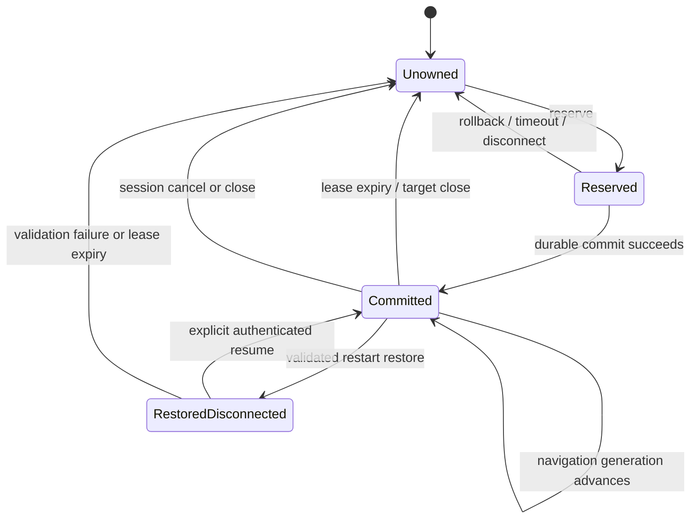

# ADR-001: Named automation sessions and transactional target ownership

- Status: Accepted for staged implementation
- Date: 2026-07-31
- Issue: #72
- Decision: GO for a dedicated session/ownership subsystem; NO-GO for adding sticky ownership to `SessionRegistry.activeHandle`

## Context

`SessionRegistry` currently tracks live extension and Electron transport
handles. Its `activeHandle` and fallback resolution are presentation and
connectivity conveniences, not durable automation-session semantics. A named
automation session needs a stable identity, an explicit default target, and
exclusive adopted-target ownership that remains correct across asynchronous
attach, disconnect, and restart.

Adding ownership to the current active-handle fallback would conflate four
different identities:

1. transport connection
2. named automation session
3. root page target
4. one navigation generation within that root

That design would silently retarget work when focus or connection order
changes. This ADR rejects it.

## Decision

Build named automation sessions as a server-owned subsystem beside the live
target registry. A session may adopt a target only through a transactional
reserve/commit operation. A committed target becomes that session's sticky
default; absence of a committed target is an error or an explicit request to
use legacy stateless resolution, never an implicit fallback.

The executable prototype is
`packages/server/src/prototypes/named-session-ownership.ts`. It is intentionally
not imported by the bridge server. The prototype proves the domain rules while
keeping this ADR reversible.

## Invariants

1. A target root has at most one reservation or committed owner.
2. A reservation is memory-only, short-lived, and never restored.
3. Ownership becomes visible only after its committed snapshot is durably
   written.
4. A failed durable write leaves the reservation intact and creates no
   ownership.
5. A committed lease blocks other sessions until release, target closure,
   session cancellation/closure, or lease expiry.
6. Disconnect rolls back reservations. It does not silently transfer committed
   ownership.
7. Restart restores only committed, unexpired ownership whose root identity is
   still validated by the live target adapter.
8. Restored sessions are disconnected. Restore never resumes tasks, handoffs,
   write locks, or commands.
9. Navigation may advance `navigationGeneration` for the same owned root. A
   different `rootGeneration` is a different target and cannot inherit
   ownership.
10. A session with no committed default target never falls back to whichever
    tab or connection is active.
11. Bearer tokens and raw connection identifiers are not ownership identity and
    are never persisted in the ownership snapshot.
12. Capability authorization is re-evaluated at every command, including after
    resume or restoration.

## Identity model

Named sessions have an opaque `sessionId`, a unique human-safe name, lifecycle,
and monotonically increasing `connectionEpoch`. Names are labels; authorization
uses the opaque ID.

Chrome root identity is:

```text
(extensionInstanceId, windowId, tabId, rootGeneration)
```

Electron root identity is:

```text
(appId, electronSessionId, windowRef, targetId, rootGeneration)
```

`navigationGeneration` is carried beside either root. It is required for exact
refs, handoffs, and result attribution, but it is not part of the exclusive
root key. Same-tab navigation advances the generation and invalidates
generation-bound work without transferring root ownership.

`rootGeneration` changes when an identity can no longer safely mean the same
root: tab ID reuse, extension-instance replacement, Electron target
replacement, or an equivalent adapter reset. A changed root generation must
reserve and commit as a new target.

## Ownership state machine



Reserve is serialized at the ownership store. It fails with a structured
conflict naming the current owning session ID; it never waits silently or
steals.

Commit receives the reservation ID and lease duration. The store constructs
the next durable snapshot without mutating visible state, writes it atomically,
then replaces the reservation with committed ownership. On persistence failure
the caller may retry commit or explicitly roll back.

Rollback is idempotent: the first call releases the reservation and later calls
report that nothing was present.

## Session lifecycle

- `active`: may reserve, commit, and execute.
- `disconnected`: may retain unexpired committed ownership but cannot execute
  or reserve. All reservations are rolled back.
- `cancelled`: terminal; reservations and ownership are released. Associated
  work is recorded as cancelled.
- `closed`: terminal successful administrative closure; reservations and
  ownership are released.

Resume is explicit and authenticated. It changes `disconnected` to `active`,
increments `connectionEpoch`, and re-evaluates policy. A transport reconnect
alone is insufficient.

## Lifecycle events

### Lease expiry

Reservations and ownership use server time and absolute expiry timestamps.
Expiry is checked before reserve/commit and by a periodic sweeper. Expired
records are released transactionally.

### Disconnect and cancellation

CLI, MCP, extension, or Electron transport disconnect rolls back pending
reservations associated with that connection epoch. Committed ownership
remains until its lease expires so a transient reconnect cannot transfer the
target. Explicit task cancellation does not automatically cancel the whole
session; explicit session cancellation does.

### Tab or Electron target closure

The live target adapter emits exact root closure. Reservations and committed
ownership for that root are released. Tab IDs or Electron target IDs observed
later require a new root generation and cannot revive the old lease.

### Navigation

Navigation advances the committed target's `navigationGeneration`. Sticky
selection remains on the same root. Generation-bound refs, pending handoffs,
and in-flight mutation validation fail closed and must be reacquired.

### Extension reload

Reload changes `extensionInstanceId` or `rootGeneration`. Old Chrome roots fail
validation and are not restored. No ownership is inferred solely from matching
window/tab numbers.

### Bridge restart

The server reads one versioned ownership snapshot, marks all restored sessions
`disconnected`, discards all reservations, removes expired leases, and asks the
Chrome/Electron adapter to validate every committed root. A validator may
advance navigation generation for the same root. It may not substitute a
different root.

## Persistence boundary

Persist:

- session ID, name, lifecycle, timestamps, and connection epoch
- committed ownership ID, session ID, exact root identity, latest navigation
  generation, commit time, and lease expiry
- schema version and snapshot time

Do not persist:

- reservations
- WebSocket/CDP objects or connection IDs
- bearer tokens, OAuth material, cookies, or capability grants
- in-flight command bodies
- task execution stacks
- handoff waiters or DOM acknowledgements
- write locks

Production persistence should use an atomic temp-file write, fsync, rename, and
mode `0600`, with one corruption-quarantine path. The prototype injects a
persistence adapter and proves state publication occurs only after `save`
resolves.

## Failure semantics

- Ownership conflict: fail with `TARGET_ALREADY_OWNED`, target root key, and
  owning session ID. Do not reveal tokens, client addresses, or task content.
- Reservation timeout: treat as rolled back; commit returns a missing/expired
  reservation error.
- Commit write failure: no committed state becomes visible; reservation remains
  retryable until expiry.
- Disconnect during reserve: rollback.
- Disconnect during commit: the serialized commit either durably completed or
  did not. The persisted snapshot is authoritative.
- Invalid restart snapshot: fail closed, quarantine it, and restore no
  ownership.
- Target validation failure: drop that ownership and journal the bounded
  reason.
- Navigation race: reject generation-bound action results and reacquire exact
  state. Never replay a mutation automatically.

## Security model

Session resume requires a fresh authenticated principal and a session-scoped
resume capability bound to the current `connectionEpoch`. The bearer token used
to access the bridge is transport authentication, not proof of session
ownership.

Adopt/reserve/commit are sensitive write operations. Capability policy is
evaluated against the exact Chrome extension instance or allowlisted Electron
app at reserve and again at commit. Every later command is authorized again;
committed ownership does not grant capabilities.

Conflict responses expose only bounded opaque IDs. Journals store hashed session
identity and safe target metadata under the existing privacy rules. Ownership
snapshots are mode `0600` and contain no secrets.

## Tasks, handoffs, journals, and write locks

- Tasks reference `automationSessionId`, `connectionEpoch`, target root key,
  and navigation generation. Restored sessions do not resume task execution.
- Handoffs additionally bind their exact target and generation. Navigation,
  target close, disconnect timeout, or session cancellation terminates the
  handoff; restoration never recreates its waiter.
- Operation aftermath records the named session's privacy-safe journal key and
  target generation. Reserve, commit, rollback, conflict, expiry, resume, and
  release each produce bounded lifecycle aftermath.
- Existing per-handle write locks remain transient command serialization.
  Session ownership does not replace them. On resume, a new connection epoch
  starts with no inherited write lock.

## Stateless CLI and MCP compatibility

Existing commands remain stateless in phase one:

- no `--session`: preserve current explicit `--target` behavior and current
  active-handle fallback
- `--session <name-or-id>` with explicit `--target`: authorize the named
  session, use the explicit target for that command, and do not adopt it
- `--session <name-or-id>` without target: require one committed sticky target
  or return `SESSION_TARGET_REQUIRED`
- adoption is a separate explicit command/tool with reserve/commit semantics
- MCP task creation records whether resolution was `legacy-stateless`,
  `session-explicit`, or `session-sticky`

No existing command is silently migrated into ownership. Deprecation of legacy
active fallback, if desired, requires a later ADR and telemetry.

## Prototype evidence

The executable prototype and unit tests prove:

- two concurrent sessions cannot both reserve one target
- reserve timeout and rollback are deterministic
- failed durable commit publishes no ownership
- disconnect rolls back reservations and retains committed ownership only
  until lease expiry
- navigation advances generation without changing root ownership
- target closure releases ownership
- restart restores only committed, unexpired, validated roots
- restored sessions remain disconnected until explicit resume
- snapshots contain no reservations

Run:

```bash
npx vitest run tests/unit/bridge/named-session-ownership-prototype.test.ts
```

## Go/no-go decision

GO: implement the dedicated subsystem in phases after review of this ADR and
prototype.

NO-GO:

- do not modify `SessionRegistry.activeHandle` to remember sticky targets
- do not persist reservations, tasks, handoff waiters, write locks, or bearer
  material
- do not restore a session directly into `active`
- do not infer ownership from focus, connection order, tab number, or Electron
  window label alone

## Implementation decomposition

1. Promote prototype contracts into a protocol-neutral domain package and add a
   versioned mode-0600 atomic snapshot adapter.
2. Add exact Chrome and Electron root validators with root-generation
   authorities.
3. Add authenticated session create/list/resume/cancel/close commands.
4. Add explicit adopt reserve/commit/rollback commands and structured
   conflicts.
5. Add session-aware target resolution beside, not inside, legacy stateless
   resolution.
6. Bind tasks, handoffs, operation aftermath, and write locks to session ID,
   connection epoch, root, and navigation generation.
7. Add CLI `--session` and MCP session fields while preserving stateless
   compatibility.
8. Add crash, disconnect, lease, reload, navigation, corruption, and
   multi-session integration tests before enabling the feature by default.

## Consequences

This adds an explicit subsystem and more lifecycle events, but it keeps
transport discovery separate from durable automation intent. The extra
reserve/commit round trip is deliberate: it makes conflicts and partial
failure observable. Existing stateless behavior remains available while named
sessions are introduced without semantic drift.
